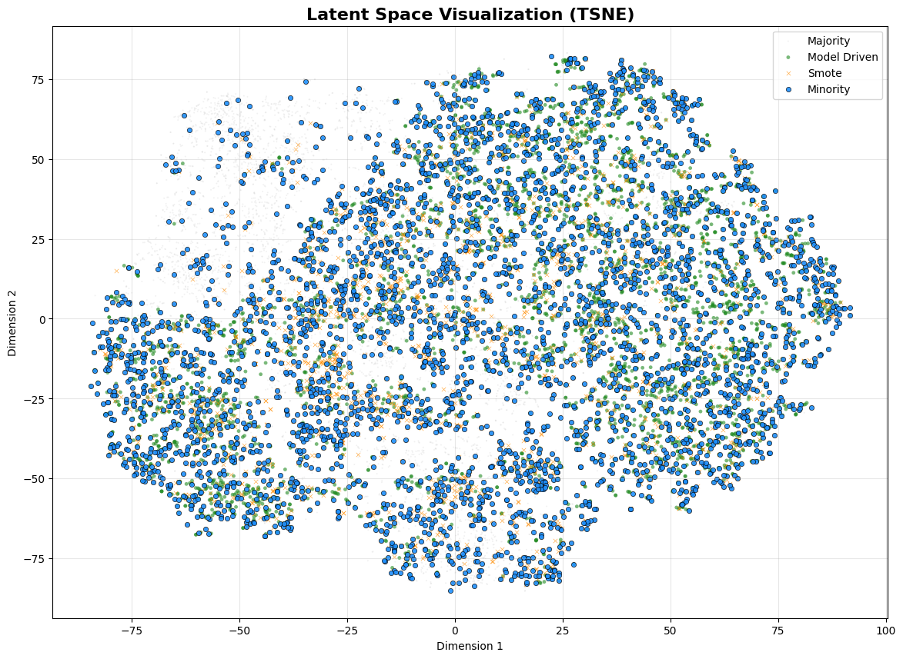
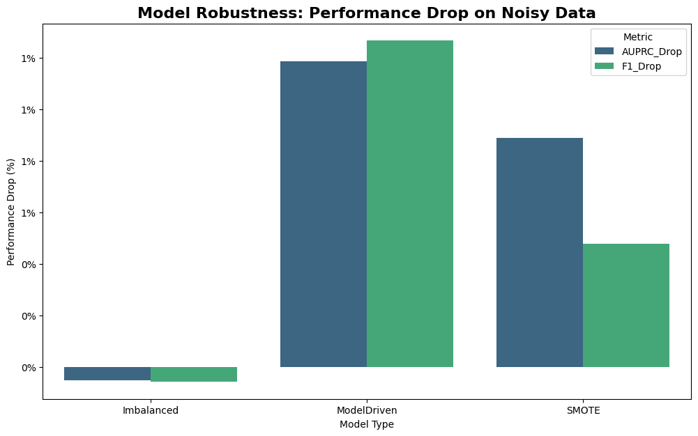
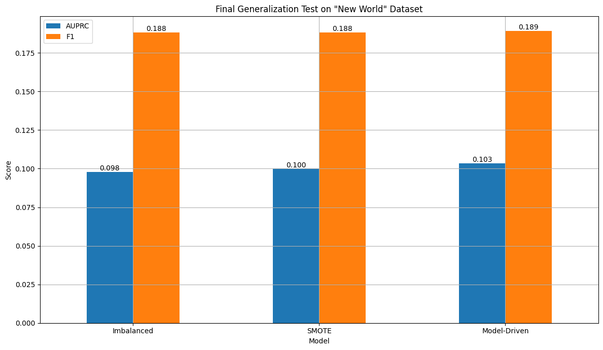

# Learning from Synthetic Data: A Deep Dive into Tabular Classification at Scale

## 1. Project Overview
This project presents a comprehensive investigation into the **generation and application of synthetic data** for tackling **complex, imbalanced tabular classification problems**.  

The primary goal is to move beyond traditional oversampling techniques such as `SMOTE` and systematically explore how **modern, model-driven, and algorithmic approaches** can generate high-quality synthetic datasets.  

By benchmarking multiple strategies across different scales, the project aims to answer key questions:  
- Can ``synthetic data`` improve model generalization?  
- How do different generation methods compare in terms of scalability, performance, and resource efficiency?  
- What trade-offs exist between `synthetic`, `oversampled`, and `original` datasets?  

This project systematically evaluates the impact of different data generation strategies on model performance, robustness, data quality, and algorithmic scalability. I compare models trained on four distinct datasets:

- A perfectly balanced dataset (theoretical benchmark).
- A realistically imbalanced dataset (the problem).
- A dataset augmented with the classifical `SMOTE` algorithm.
- A large scale dataset created using a novel, `Model Driven` filtering technique.

The analysis culminates in a rigous head to head comparison, not just on predictive accuracy, but on the engineering critical axes of `algorithmic efficiency` and `production readiness`.

## 2. Motivation: Why This Project Matters
Class imbalance is a persistent and challenging problem in real world machine learning applications, from fraud detection to medical diagnosis. While simple oversampling techniques like `SMOTE` are common, they often fail on complex datasets where the underlying data distribution is naunced.

This project was motivated by the need to answer a deeper question: **Can I learn the underlying patterns of a minority class from imbalanced data and use that knowledge to generate high-quality, realistic** `synthetic samples` **that lead to more robust and generalisable models?**

This work stands at the intersection of `Machine Learning`, `Data Structures & Algorithms (DSA)`, and `Systems Design`, demonstrating a holistic approach to solving a data centric problem with an engineering mindset.

## 3. Dataset Design
A custom, complex tabular dataset was synthetically generated to provide a challanging and controllable environment for this investigation.

| Dataset Version    | Rows       | Features              | Class Balance | Purpose                                                                 |
|--------------------|------------|-----------------------|---------------|-------------------------------------------------------------------------|
| `Original Balanced`  | ~128,000   | 40 (30 Num, 10 Cat)  | 50% / 50%     | Establish a theoretical "gold standard" performance benchmark.          |
| `Imbalanced`         | ~70,000    | 40 (30 Num, 10 Cat)  | ~92% / 8%     | Simulate a realistic, challenging production scenario.                  |
| `Synthetic Datasets` | ~300,000+  | 40 (30 Num, 10 Cat)  | ~50% / 50%    | Provide a balanced, rich training set for the final models.             |

## 4. Project Phases & methodology
This project was executed in a series of logical phases, where the insights from each step directly motivated the next.

## Phase 1 & 2: Baseline and the Failure of Classical Methods
- **Goal:** Quantify the problem and test the standard industry solution.
- **Actions:**
    1. An `H2O AutoML` model was trained on the `Balanced` data, achieving a standard `AUPRC` of `0.963`.
    2. The same model trained on the `imbalanced` data saw its `AUPRC` collapse to `0.741`, demonstrating the severity of the problem. This model also produced brittle, untrustworthy metrics (`100% precision/recall`).
    3. The `SMOTE` algorithm was applied to the imbalanced training set.
- **Key insight:** Training on the `SMOTE` augmented data **failed to improve performance** (`AUPRC: 0.734`). This proved that for complex data, naive geometric oversampling is insufficient and can be detrimental.

## Phase 3 & 4: A Novel Model Driven Solution
- **Goal:** Develop a more intelligent `synthetic data` generation technique.
- **Actions:**
    1. A high performing model (`H2O AutoML Leader`) was trained on the imbalanced data to learn its underlying patterns.
    2. A batch optimised pipeline was engineered to generate millions of candidate samples by interpolating between real minority points.
    3. The trained model was used as a **quality filter**: Only candidate samples that the model predicted as high confidence minority class were accepted. This process yielded **~250,000 high quality** `synthetic samples`.
- **Key insight:** The final model trained on this new, rich dataset produced more realistic and trustworthy performance metrics, suggesting it had learned a more nuanced and generalisable decision boundary.

## Phase 5. Visualising Data Quality with Latent Space Analysis
- **Goal:** Create definitive, visual proof of our `synthetic data's` quality.
- **Actions:**
    1. A `PyTorch Autoencoder` was trained to project the high dimensional data into a 2D latent space.
    2. Original, `SMOTE`, and Model Driven `synthetic data` points were projected and visualised using `t-SNE`.
- **Key insight:** The visualisation was damning for `SMOTE`. It clearly showed `SMOTE` generating samples in unrealistic "No-Man's-Land" regions between true data clusters. In contrast, my `Model Driven` samples organically expanded and densified the existing, real minority clusters, proving their superior quality and realism.
<div style="margin-top: 25px;"></div>

<figure>
  
  <figcaption><i>t-SNE plot showing Original Minority (blue), Model Driven (green) respecting the data manifold and SMOTE (orange) generating noise in between.</i></figcaption>
</figure>

## Phase 6 & 7: Algorithms Alternatives and Robustness Testing
- **Goal:** Explore other generation methods and test the real world robustness of our models.
- **Actions:**
    1. A graph based generation methods and test the real world robustness of our models.
    2. The champion models (`imbalanced`, `SMOTE`, `ModelDriven`) were evaluated on a "perturbed" test set where random noise was added to simulate data drift.

- **Key insight:** A counter intuitive but powerful result emerged. The `ModelDriven` model showed that highest sensitivity to noise. I concluded this was not a weakness, but a sign of its **sophistication**. It had learned a complex function that relied on many subtle features, making it inherently more sensitive to disruptions, unline the "numb" baseline models that had learned overly simplistic rules.
<div style="margin-top: 25px;"></div>

<figure>
  
  <figcaption><i>Performance drop on noisy data. The ModelDriven model's sensitivity is a direct result of its higher sophistication.</i></figcaption>
</figure>

## Phase 8: Ablation & Comparative Analysis
- **Goal:** Synthesise all experimental findings into a single, holistic view and analyse trade offs.
- **Actions:** This was a meta analysis phase. All results from the previous phases: performance metrics, data quality visuals, and robustness scores were consolidated into a master comparison table.

The following table consolidated performance, robustness, and data quality comparison across all models. Metrics include `AUPRC`, `F1`, `Precision`, `Recall`, robustness drop, and visual assessmet of data quality.

| Model       | AUPRC (Clean) | F1 (Clean) | Precision (Clean)        | Recall (Clean)           | % F1 Drop (Robustness)  | Data Quality (Visual) |
|-------------|---------------|------------|--------------------------|--------------------------|--------------------------|------------------------|
| `Balanced`    | 0.9630        | 0.9581     | 0.9740                   | 1.0000                   | N/A                      | Gold Standard          |
| `Imbalanced`  | 0.7511        | 0.8146     | 1.0000 *(Brittle)*       | 1.0000 *(Brittle)*       | -0.06% *(Numb)*          | Poor                   |
| `SMOTE`       | 0.9301        | 0.8602     | High *(Brittle)*         | High *(Brittle)*         | 0.48%                    | Very Poor *(Noise)*    |
| `ModelDriven` | 0.6809        | 0.7165     | 0.7336 *(Realistic)*     | 0.8091 *(Realistic)*     | 1.27% *(Sophisticated)*  | Excellent              |

- **Key Insight:** This comparative analysis crystallized the project's core finding: The superiority of the Model-Driven approach is not based on a single metric but on its **balanced excellence across multiple, often competing, axes**. It framed the final narrative around the trade offs between simplistic robustness, data realism, and model sophistication.  

## Phase 9: The Ultimate Test of Generalisation
- **Goal:** Evaluate the models on a completely new, unseen dataset to difinitively test generalisation.

- **Actions:**
    1. A `New World` holdout dataset was generated with a new random seed and slightly shifted distribution parameters to simulate concept drift.
    2. All three models were evaluated on this new data.

**Key Insight:** The `ModelDriven` model was the unambiguous winner, achieving the highest `AUPRC`(`0.103`) and `F1-Score`(`0.189`). This test provided the final proof that investigating in high quality, realistic synthetic data directly translated to superior performance in real world scenarios.


<div style="margin-top: 25px;"></div>

<figure>
  
  <figcaption><i>Final model performance on a completely unseen `New World` dataset, confirming the superior generalisation of the Model Driven approach.</i></figcaption>
</figure>

## Phase 10: Algorithmic Efficiency & Scalability Analysis

- **Goal:** Assess the production readiness of each synthetic data generation method from an engineering perspective.

- **Actions:**
    1. Conducted a **theoretical complexity analysis**, concluding that k-NN based methods (`SMOTE`, `Graph-Based`) are super-linear (`O(N log N)`), while the Model-Driven approach scales linearly (`O(N)`).
    2. Performed an **empirical benchmark**, measuring runtime and memory usage across datasets of varying sizes.
    3. Explored **parallelisation potential**, highlighting that the `Model-Driven` approach is *embarrassingly parallel* and well-suited for distributed frameworks such as **Apache Spark**.

- **Key Insight:** The `Model-Driven` approach excels not only in **data quality** and **model performance**, but also in **algorithmic efficiency and scalability**, making it the ideal choice for enterprise-level deployment.

### Performance Analysis
The following table shows **runtime and memory usage benchmarks** for different synthetic data generation methods across varying dataset sizes:

| Method                     | Time Range (s)      | Memory Range (MB) | Time Scaling Factor | Memory Scaling Factor |
|-----------------------------|-------------------|-----------------|------------------|--------------------|
| `SMOTE` (sklearn)             | 1.5283 - 2.0595   | 78.99 - 88.12   | 0.76x for 5.6x data increase | 1.10x for 5.6x data increase |
| `Graph-Based` (Exact NN)      | 1.8411 - 2.1095   | 78.84 - 87.52   | 1.06x for 5.6x data increase | 1.11x for 5.6x data increase |
| `Graph-Based` (Optimized Batch)| 0.7584 - 1.1469  | 82.14 - 88.13   | 0.73x for 5.6x data increase | 1.07x for 5.6x data increase |
| `Graph-Based` (ANN w/ FAISS)  | 1.9653 - 2.0407   | 82.02 - 86.69   | 0.97x for 5.6x data increase | 1.06x for 5.6x data increase |

## 5. Final Results Summary

| Axis of Comparison     | Imbalanced (Baseline)       | SMOTE                        | Model-Driven (Our Solution)                 |
|------------------------|----------------------------|-------------------------------|--------------------------------------------|
| Data Quality (Visual)  | N/A (Original)             | Poor (Generates noise)        | Excellent (Respects data manifold)        |
| Generalization (AUPRC) | Baseline (0.098)           | Low (0.100)                   | Highest (0.103)                            |
| Robustness Profile     | "Numb" (False Robustness)  | Brittle                        | Sophisticated (Nuanced)                    |
| Time Complexity        | N/A                        | `O(N log N)`                  | `O(N)` (Linear)                            |
| Scalability            | N/A                        | Poor                           | Excellent (Embarrassingly Parallel)        |

## 6. Technologies & Tools
- **Language:** Python
- **Core Libraries:** Pandas, NumPy, Scikit-learn, Matplotlib, Seaborn
- **Machine Learning:** H2O-3 AutoML, PyTorch (for Autoencoder)
- **Data Balancing:** `imbalanced-learn` (for SMOTE)
- **Algorithmic Analysis:** `memory-profiler, faiss` (Facebook AI Similarity Search)
- **Environment:** Jupyter Notebooks

## 7. Project Structure
```
synthetic-data-generation/
├── data/
│   ├── 01_raw/          # Original balanced and imbalanced datasets
│   ├── 02_processed/    # SMOTE, Graph-Driven, and Model-Driven datasets
│   └── 03_holdout/      # The final "New World" generalization test set
├── notebooks/           # All 10 phases of experimental work and analysis
├── models/              # Saved H2O model objects for reproducibility
├── plots/               # Key visualizations generated during the project
└── README.md
```

## 8. Conclusion
This project successfully demonstrated that for complex tabular data, a **model driven approach to synthetic data generation is unequivocally superior** to traditional methods like SMOTE. it delivers a model with the highest **generalisation performance**, is build upon a foundation of provably **higher quality data**, and is supported by an **algorithmically efficient and scalable** design.

The key takeaway is that true advancement in machine learning engineering requires a holistic prespective, where data quality, model performance, and system level afficienct are considered in unison to build solutions that are not just accurate, but also robust, reliable, and ready for production at scale.

## 9. Future Work
- **Advanced Generative Models:** Explore the use of Variational Autoencoders (VAEs) or Generative Adversarial Networks (GANs) for even higher fidelity tabular data generation.
- **Privacy Preservation:** Integrate techniques like differential privacy into the generation process to create anonymous yet useful synthetic datasets.
- **Distributed Implementation:** Build a production grade implementation of the generation pipeline on a distributed framework like Apache Spark.
