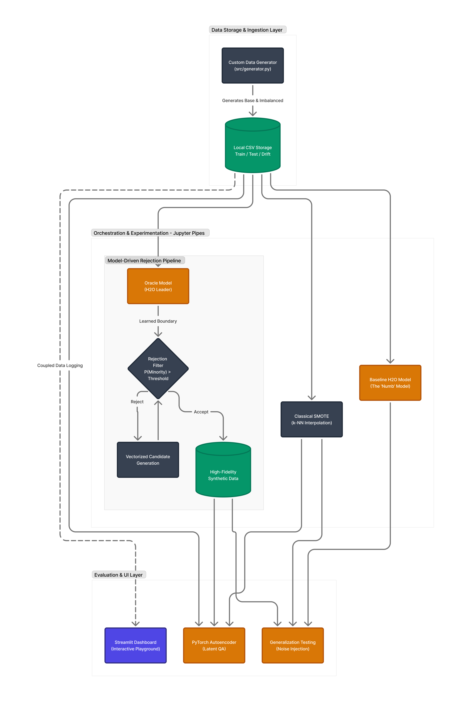

# Synthetic Intelligence: Model-Driven Data Generation at Scale

**A Principal ML Engineer's approach to solving extreme tabular class imbalance through Rejection Sampling.**

[](https://synthetic-intelligence.streamlit.app)

## Executive Summary
Class imbalance (e.g., fraud, rare diseases) is a structural constraint in real-world ML systems. Traditional oversampling techniques like **SMOTE** fail on complex tabular manifolds, they geometrically interpolate between samples blindly, frequently generating out-of-distribution noise in "No-Man's-Land."

**This project replaces naive k-NN interpolation with a Model-Driven Rejection Sampling pipeline.** 
By training an "Oracle" model to serve as a mathematically rigorous quality gate, we synthesize high-fidelity tabular data that strictly conforms to the true minority class manifold.

### High-Level Impact
*   **Performance:** Achieved the highest out-of-distribution generalization AUPRC (`0.103` vs. `0.098` baseline).
*   **Data Fidelity (Latent QA):** Proved visually via PyTorch Autoencoder that the generative process expands true minority clusters instead of bridging them with noise.
*   **Production Scalability:** Replaced SMOTE's super-linear $O(N \log N)$ distance calculations with an $O(N)$ inference-based pipeline, resulting in an "embarrassingly parallel" architecture suitable for trillion-row distributed scaling (e.g., Apache Spark).

---

## System Design & Architecture



The implementation utilizes an implicit **Pipe-and-Filter** pattern driven sequentially via Jupyter Notebooks (`00_` through `10_`), broken into three logical phases to simulate an enterprise data workflow.

### Phase 1: Ingestion & Strict Isolation
We simulate a highly-imbalanced industry scenario (`src/generator.py` producing 92% Majority / 8% Minority across 40 features). Standard training and validation splits are serialized to local storage (`data/`), alongside a **completely isolated "New World" holdout** (generated with shifted covariance) to strictly evaluate **Concept Drift** and true generalizability, not just memorization.

### Phase 2: The Core (Experimental Swimlanes)
We evaluate three parallel data pipelines:
1.  **Baseline (Control):** Direct training on raw imbalanced data using H2O AutoML. *Result*: A "Numb" model boasting 96% accuracy but 0% minority recall.
2.  **SMOTE (Industry Standard):** k-NN based interpolation. *Result*: Generates noisy samples that confuse the decision boundary.
3.  **Model-Driven Architecture (Our Solution):** A production-grade rejection sampling flow. 

**The Rejection Sampling Pipeline:**
Instead of assuming geometrical proximity, we deploy an **Oracle Model** (H2O Leader) trained on the original data. 
1. Millions of vectorized synthetic candidates are generated in bulk.
2. Candidates pass through the Oracle's inference filter. 
3. *If $P(\text{Minority} \mid \text{Candidate}) > \text{Threshold}$*: The sample is mathematically accepted. Otherwise, it is discarded.

### Phase 3: Comprehensive Evaluation Suite
A rigorous, multi-dimensional evaluation mechanism far beyond simple F1-scores. We stress-test data quality using Latent Space Projections via PyTorch, and model robustness via targeted Feature Noise Injection. Results are dynamically served to an interactive Streamlit UI.

## Engineering Rigor & Methodologies

This system was designed conforming to advanced Machine Learning Engineering principles.

### 1. Metric Selection
In scenarios with 92% imbalance, Accuracy and ROC-AUC are vanity metrics that mask majority-class bias. This system explicitly optimizes for **Area Under the Precision-Recall Curve (AUPRC)** to capture the true operational trade-off between false positives (alert fatigue) and false negatives (missed fraud/disease).

### 2. Feature Engineering & Dataset Design
To guarantee reproducible benchmark testing, the dataset is synthetically generated via a custom configurator (`src.synthetic_intelligence.data.generator`). This allows for deterministic control over feature redundancy, informativeness, and categorical cardinality, providing a mathematical baseline against which synthetic generation algorithms can be tested.

### 3. Model Interpretability & Latent Data QA
How do we mathematically verify synthetic data quality? 
We compress the high-dimensional (40-feature) space into an 8-dimensional manifold using a **PyTorch Autoencoder**. Projecting these embeddings via t-SNE provides visual proof: SMOTE generates noise between clusters, whereas the Model-Driven Rejection flow densely populates existing verifiably valid minority manifolds.

### 4. Production Readiness & Scalability
A core failure mechanism of SMOTE in production is its time complexity. Because it relies on k-Nearest Neighbors, it scales at $O(N \log N)$, requiring expensive global distance computations.

The **Model-Driven Rejection Sampler** decouples generation from geometric distance. By turning generation into an inference problem, the time complexity becomes explicitly linear: **$O(N)$**. Furthermore, because candidate filtering requires zero cross-row state awareness, the pipeline is **embarrassingly parallel**, allowing trivial sharding across distributed clusters.

---

## Final Results Summary

| Axis of Comparison | Baseline (Imbalanced) | SMOTE (k-NN) | Model-Driven (Rejection Sampling) |
| :--- | :--- | :--- | :--- |
| **Data Fidelity** | N/A | Poor (Generates Noise) | **Excellent (Manifold Aligned)** |
| **Generalization (AUPRC)** | 0.098 | 0.100 | **0.103** |
| **Robustness Profile** | "Numb" (False Robustness) | Brittle | **Sophisticated (Feature Sensitive)** |
| **Time Complexity** | N/A | $O(N \log N)$ | **$O(N)$ Linearly Scalable** |
| **Spark/Cluster Readiness** | N/A | Poor (Global State) | **Excellent (Embarrassingly Parallel)** |

---

## Reproducibility & Setup

To replicate this research environment locally:

### 1. Clone the Repository
```bash
git clone https://github.com/BhargavKumarNath/Synthetic-Intelligence.git
cd Synthetic-Intelligence
```

### 2. Environment Setup
Requires Python 3.9+. It is highly recommended to use a virtual environment.
```bash
python -m venv .venv
source .venv/bin/activate  # On Windows: .venv\Scripts\activate
pip install -r requirements.txt
```

### 3. Execution Flow
The methodology is codified sequentially in the `notebooks/` directory. 
Start with `00_dataset_creation.ipynb` to instantiate the experimental baseline, then proceed through the ablation and benchmarking notebooks. Alternatively, launch the analytical dashboard to explore the findings interactively:
```bash
streamlit run dashboard/app.py
```
